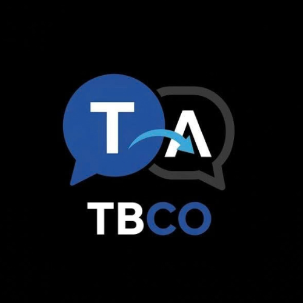

# TBCO — Translate Bot Conversation by OCR (v3.0 PRO)

<p align="center">
  
</p>

<p align="center">
  
  
  
  
  
</p>

---

## 📖 Giới thiệu

**TBCO (Translate Bot Conversation by OCR)** là ứng dụng dịch thuật thời gian thực chuyên sâu dành cho visual novel, anime RPG và game cốt truyện (đặc biệt tối ưu hóa sâu cho *Fate/Grand Order* và *Blue Archive*). 

Kế thừa các công nghệ cốt lõi từ MORT và mở rộng với kiến trúc LLM đa tầng, TBCO 3.0 mang lại tốc độ phản hồi tính bằng mili-giây, khả năng dịch ngoại tuyến 100%, bộ nhớ bản dịch SQLite hai tầng không trùng lặp, cơ chế xoay vòng Multi-Key chống lỗi Rate Limit 429, cùng hệ thống Hồ sơ Game (Game Profiles) tự động nhận diện cửa sổ và phân cảnh câu chuyện.

---

## 🚀 Các Tính Năng Đột Phá Trên TBCO 3.0

### 1. 🔑 Multi-Key Pool & Khả Năng Tự Phục Hồi (Self-Healing)
- **Quản lý đa khóa API**: Xoay vòng linh hoạt nhiều key Gemini (Round-robin leasing).
- **Tự động xử lý lỗi 429 / 401**: Khi một key chạm hạn mức (HTTP 429), hệ thống tự động đưa vào danh sách chờ nguội (cooldown timer) và chuyển mượt sang key tiếp theo mà không làm gián đoạn câu dịch. Key sai (401) bị vô hiệu hóa an toàn.
- **Bảo mật Secret Vault (Windows DPAPI)**: Mọi khóa API (Gemini, DeepL) được mã hóa bằng thuật toán DPAPI của Windows, không bao giờ lưu plaintext trong ổ cứng.

### 2. 🧠 Chuỗi Nhà Cung Cấp Đa Tầng (Multi-Provider Router & DeepL)
- **Linh hoạt lựa chọn bộ dịch**: Hỗ trợ trực tiếp từ giao diện:
  - **Google Gemini AI**: Các model mới nhất (Gemini 2.5 Flash, Gemini 3.x Flash, Pro...).
  - **DeepL Translate**: Dịch tự nhiên, văn phong chuẩn quốc tế, tự động hỗ trợ cả DeepL Free (`:fx`) và DeepL Pro API.
  - **Google Web Translate**: Dịch nhanh miễn phí 100% không yêu cầu API Key.
  - **Local AI (Ollama `qwen2.5:7b`)**: Dịch 100% ngoại tuyến, bảo mật tuyệt đối.
- **Fallback tự động liên tầng**: Khi bộ dịch chính gặp lỗi mạng hoặc hết quota, router tự động chuyển đổi thông minh xuống các tầng kế tiếp để không làm gián đoạn việc chơi game.

### 3. 💾 Bộ Nhớ Bản Dịch Hai Tầng Siêu Tốc (Two-Level Translation Memory)
- **L1 RAM LRU Cache**: Truy xuất tức thì (< 0.1 ms) cho các câu thoại xuất hiện nhiều lần.
- **L2 SQLite Persistent Storage**: Lưu trữ vĩnh viễn trên đĩa với chế độ WAL siêu tốc, ghi nhớ toàn bộ hội thoại và biến thể OCR fuzzy giữa các phiên chơi.
- **Bỏ qua gọi API**: Câu thoại cũ đã có trong Memory sẽ trả kết quả ngay, tiết kiệm 100% quota và chi phí API.

### 4. 👁️ Pipeline Tiền Xử Lý Ảnh & OCR Router (MORT Parity)
- **Tiền xử lý ảnh chuyên sâu**: Phóng to 2x sắc nét giữ cạnh font chữ (Scale2xNearest), chuẩn hóa sắc độ xám ITU-R BT.601, tách ngưỡng tự động Otsu, và bộ lọc cô lập màu vàng `#FFD700` đặc trưng cho tên Servant FGO.
- **OCR Router Fallback**: Điều phối linh hoạt giữa **Windows WinRT OCR**, **OneOCR**, và **Tesseract 5.2.0**.

### 5. 🎮 Hồ Sơ Game & Phân Cảnh (Game Profiles & Scene Intelligence)
- **Tự động nhận diện (Game Detector)**: Tính điểm cửa sổ dựa trên Process Name và Window Title để tự động nạp hồ sơ game tương ứng.
- **Hồ sơ tích hợp sẵn**:
  - `Fate/Grand Order (JP)` & `Fate/Grand Order (NA)`: Vùng quét thoại, vùng tên người nói, vùng che nút Skip/Menu, hồ sơ nhân vật (Mash, Ritsuka, Da Vinci, Romani, Gilgamesh...), từ điển game (Master, Servant, Noble Phantasm, Saint Quartz, Lostbelt...).
  - `Blue Archive`: Nhận diện Sensei, Arona, Plana, Yuuka, Kivotos, Schale...
  - `Visual Novel (Generic)`: Preset chuẩn cho game VN.
- **Chuyển đổi Phân cảnh (Scene Switching)**: Thay đổi ngữ cảnh câu chuyện giữa các chương hồi (ví dụ: Chaldea thường nhật sang Lostbelt sinh tồn), tự động bổ sung thuật ngữ riêng của chương hồi mà không làm bẩn từ điển gốc.

### 6. 🪟 Giao Diện Độc Lập & Bảng Phím Tắt Tiện Dụng
- **Cửa sổ phụ đề tách rời (Detached Subtitle)**: Phong cách Dark Glassmorphism, trong suốt xuyên chuột (`Click-Through`), ghim nổi trên cùng.
- **Bảng tra cứu phím tắt (Hotkey Cheatsheet)**: Nhấn **[F1]** hoặc nút `[⌨ Phím tắt]` trên màn hình để mở bảng tra cứu phím trực quan.
- **Hệ thống phím an toàn (không xung đột gõ văn bản Windows)**:
  - `F6`: Bật/Tắt quét liên tục tự động (Hook Loop).
  - `F7`: Chụp và dịch 1 khung hình.
  - `F8`: Chụp nhanh lưu ảnh & dịch tức thì (Snapshot).
  - `Ctrl+F8`: Chọn vùng quét OCR mới.
  - `F9`: Khóa/Mở khóa xuyên chuột phụ đề (Click-Through).
  - `F10`: Ẩn/Hiện thanh phụ đề nổi (Overlay HUD).
  - `F11`: Tách rời / Gắn lại cửa sổ phụ đề độc lập.
  - `Ctrl+T`: Dịch lại câu thoại gần nhất.
  - `Ctrl+L`: Bật/Tắt chế độ Local AI ngoại tuyến.
  - `F1`: Mở bảng tra cứu phím tắt.

---

## 📥 Hướng Dẫn Cài Đặt & Sử Dụng

### Yêu Cầu Hệ Thống
- Hệ điều hành: Windows 10 (bản 19041 trở lên) hoặc Windows 11 (x64).
- Cài đặt sẵn [.NET 8.0 Desktop Runtime](https://dotnet.microsoft.com/download/dotnet/8.0) (hoặc sử dụng bản đóng gói SelfContained).

### Khởi Chạy Nhanh
1. Tải file `TBCO-3.0-win-x64.zip` từ thư mục `publish/` hoặc GitHub Releases.
2. Giải nén vào một thư mục (ví dụ `D:\TBCO`).
3. Chạy file **`TBCO.exe`**.
4. Vào mục **[Quản lý API Key]** để thêm các khóa Gemini hoặc DeepL của bạn.
5. Mở game, TBCO sẽ tự động nhận diện cửa sổ và nạp cấu hình tối ưu nhất!

---

## 🛠️ Dành Cho Nhà Phát Triển

### Biên dịch & Chạy kiểm thử tự động
```powershell
# Chạy toàn bộ 118 test cases
dotnet test TranslateBot.Tests\TranslateBot.Tests.csproj

# Biên dịch Release
dotnet build -c Release
```

### Đóng gói phát hành tự động
Sử dụng script đóng gói tích hợp sẵn:
```powershell
.\publish.ps1
```
Bản phát hành hoàn chỉnh cùng tệp nén `.zip` sẽ được tạo tự động tại thư mục `publish/`.

---

## 📜 Giấy Phép & Bản Quyền
Dự án được xây dựng và chia sẻ phi lợi nhuận cho cộng đồng game thủ yêu thích tiểu thuyết hình ảnh và anime game. Mọi đóng góp và báo lỗi đều được trân trọng tiếp nhận!
